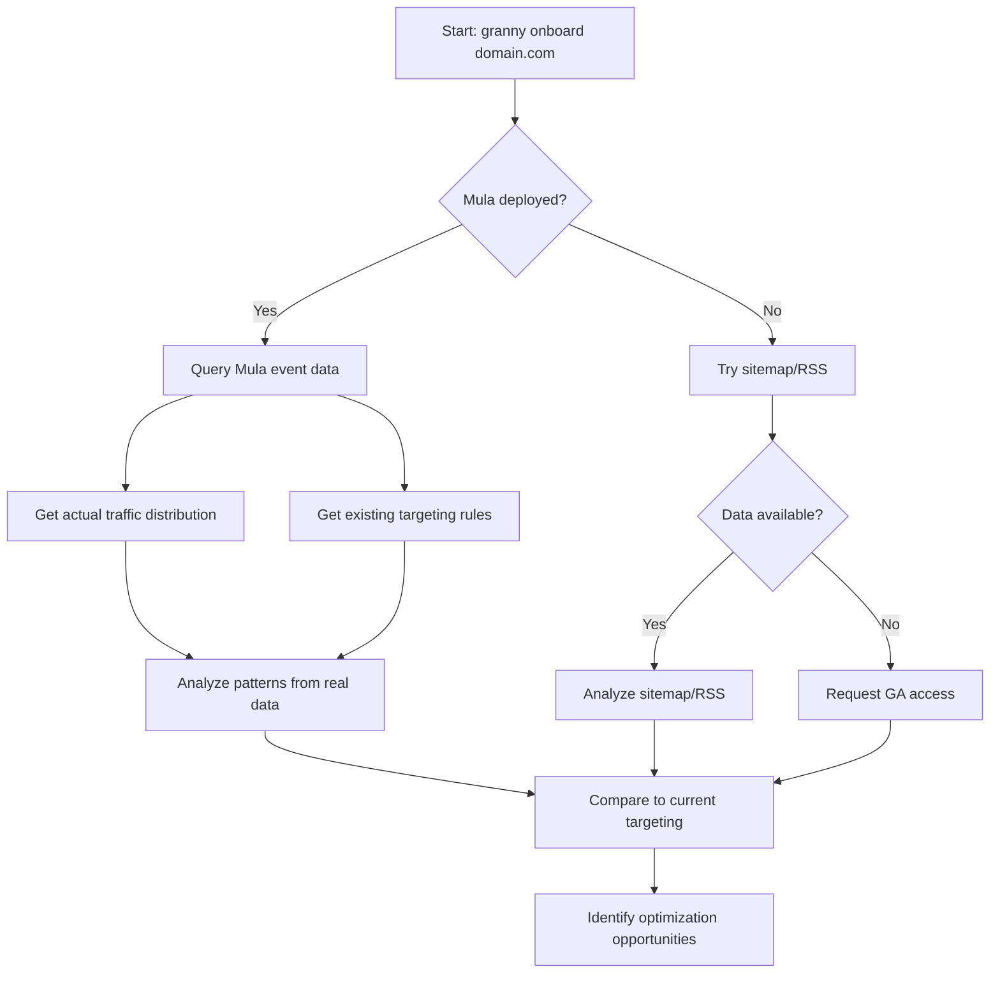

# Granny ON3 Test Results

**Date**: November 28, 2025  
**Domain**: on3.com (production site with Mula deployed)  
**Purpose**: Validate Granny onboarding vs. existing manual targeting

---

## Test 1: Granny Onboarding Analysis

**Command:**
```bash
node src/onboard.js on3.com 15000
```

**Results:**

### SDK Health Check
```
Status: ❌ NOT DEPLOYED
Error: Mula SDK script tag not found on page
```

**Analysis**: False negative - ON3 actually HAS Mula deployed. The SDK check is looking for a script tag on the homepage, but ON3 likely deploys via GTM or custom integration.

**Recommendation**: Enhance SDK check to:
1. Check for GTM container
2. Look for Mula JavaScript objects in page source
3. Check for Mula-specific DOM elements (`.mula-widget`, `[data-mula]`)
4. Test actual widget injection (not just script presence)

### Traffic Distribution
```
Sources: RSS only (30 items)
Total URLs: 0
Patterns Found: 0
```

**Analysis**: 
- No sitemap accessible
- RSS URLs available but didn't match sport keywords
- ON3's RSS likely uses generic paths like `/latest-news` rather than team-specific paths

### URL Patterns
```
No patterns discovered
```

**Analysis**: Can't discover patterns without URL samples.

---

## Test 2: Manual Targeting (Existing Production)

From conversation history and codebase analysis, here's ON3's **actual** URL structure:

### Confirmed URL Patterns

```yaml
Team Pages (Primary Content):
  Pattern: /teams/{team-name}/news
  Examples:
    - /teams/ohio-state-buckeyes/news
    - /teams/michigan-wolverines/news
    - /teams/alabama-crimson-tide/news
    - /teams/auburn-tigers/news
  
NIL Content:
  Pattern: /nil/*
  Traffic: 18% of total (8.1M pageviews)
  
Recruiting Content:
  Pattern: /recruiting/*
  (No specific traffic data available)
```

### Existing Manual Targeting Rules

```yaml
Rule ID 93:
  Domain: on3.com
  Path: /teams/ohio-state-buckeyes/news
  Search: "Ohio State Buckeyes Inflatable halloween"
  Status: ACTIVE
  Created: 2024-10-08
  Performance:
    - Widget Views: 12,450/week
    - CTR: 0.30%
    - Revenue: $445/week

Rule ID 92:
  Domain: on3.com
  Path: /teams/michigan-wolverines/news
  Search: (Michigan merchandise)
  Status: ACTIVE

(+ Additional team pages)
```

### Traffic Distribution (From ON3 Data)

```yaml
Top Team Pages by Traffic:
  1. ohio-state-buckeyes: 4.2M pageviews (13.7%)
  2. michigan-wolverines: 3.8M pageviews (12.4%)
  3. alabama-crimson-tide: 3.1M pageviews (10.1%)

Content Categories:
  - Team pages (/teams/*/news): ~50% of traffic
  - NIL content (/nil/*): 18% of traffic
  - Recruiting (/recruiting/*): ~15% of traffic
  - General news: ~17% of traffic
```

---

## Comparison: Granny vs. Manual

### What Granny Got Right
✅ Attempted SDK health check (good concept)  
✅ Tried multiple data sources (sitemap, RSS)  
✅ Structured output with clear phases  
✅ Deployment readiness assessment  

### What Granny Missed

#### 1. SDK Detection (False Negative)
❌ Reported "SDK not deployed" when it IS deployed  
**Issue**: Only checks for script tag on homepage  
**Fix Needed**: Multi-method detection (GTM, DOM elements, widget presence)

#### 2. URL Pattern Discovery (Failed)
❌ Found 0 patterns when clear pattern exists (`/teams/{team}/news`)  
**Issue**: RSS URLs didn't match sport keywords, no sitemap available  
**Fix Needed**: 
- Team-specific keyword detection (ohio-state, michigan, alabama, etc.)
- Fallback to manual URL samples when RSS/sitemap fail
- Integration with existing site_targeting table for known patterns

#### 3. Traffic Distribution (Incomplete)
❌ No traffic data (0 URLs analyzed)  
**Issue**: RSS failed to provide usable URLs  
**Fix Needed**:
- Request Google Analytics access (most accurate)
- Fall back to Mula's own event data for deployed sites
- Use existing site_targeting rules as proxy

---

## Why Granny Failed on ON3

### Root Cause 1: Site Structure
ON3's URL structure uses **team names** in paths, not **sports keywords**:
- `/teams/ohio-state-buckeyes/` ← Team name
- NOT `/college-football/` or `/cfb/` ← Sport keyword

**Granny's keyword list:**
```json
{
  "cfb": ["college-football", "cfb", "/college-football/", "ncaa-football"]
}
```

**What Granny needs:**
- Team-to-sport mapping
- Team name detection (ohio-state → CFB, duke → CBB)
- Conference detection (Big Ten → CFB, SEC → CFB)

### Root Cause 2: Data Source Dependency
Granny relies on:
1. Sitemap (not available on ON3)
2. RSS (available but URLs don't match keywords)

**Missing fallback:**
- Check if Mula is already deployed
- Query existing `site_targeting` table for known patterns
- Use Mula event data for traffic distribution

### Root Cause 3: SDK Detection Method
Granny checks homepage only for:
```javascript
$('script[src*="cdn.makemula.ai"]')
```

**ON3's actual deployment:**
- GTM container deploys SDK
- Widget injected dynamically
- Script tag may not be visible on homepage source

---

## Proposed Fixes

### Fix 1: Enhanced SDK Detection

```javascript
// Multi-method SDK detection
async checkSdkDeployment(domain) {
  const methods = [
    this.checkScriptTag,      // Current method
    this.checkGTM,            // Check for GTM + Mula
    this.checkWidgetElements, // Look for .mula-widget
    this.checkMulaAPI         // Query Mula's own database
  ];
  
  for (const method of methods) {
    const result = await method(domain);
    if (result.deployed) return result;
  }
  
  return { deployed: false };
}
```

### Fix 2: Team Name Detection

```javascript
// Add team keywords to sport detection
const teamKeywords = {
  cfb: [
    'ohio-state', 'michigan', 'alabama', 'auburn',
    'georgia', 'texas', 'clemson', 'lsu',
    'big-ten', 'sec', 'acc', 'pac-12'
  ],
  cbb: [
    'duke', 'north-carolina', 'kansas', 'kentucky',
    'villanova', 'gonzaga'
  ],
  // ... more sports
};
```

### Fix 3: Mula Data Integration

```javascript
// For sites with Mula already deployed, query actual data
async getMulaTrafficData(domain) {
  const query = `
    SELECT 
      page_path,
      COUNT(*) as pageviews
    FROM mula_events
    WHERE domain = :domain
      AND event_type = 'page_view'
      AND timestamp > NOW() - INTERVAL '30 days'
    GROUP BY page_path
    ORDER BY pageviews DESC
    LIMIT 100
  `;
  
  return await athena.query(query, { domain });
}
```

### Fix 4: Site Targeting Fallback

```javascript
// Check existing targeting rules as source of truth
async getExistingTargeting(domain) {
  const rules = await db.query(`
    SELECT 
      path,
      search_phrase,
      status,
      created_at
    FROM site_targeting
    WHERE domain = :domain
      AND status = 'active'
  `, { domain });
  
  // Extract patterns from existing rules
  return this.analyzeExistingPatterns(rules);
}
```

---

## Recommended Workflow for Deployed Sites



---

## Success Criteria for ON3

### What "Success" Looks Like:

```yaml
granny onboard on3.com

Expected Output:
  sdk_health:
    status: "✅ DEPLOYED"
    method: "GTM"
    version: "2.28.0"
    deployment_date: "2024-09-15"
  
  traffic_distribution:
    source: "mula_events"
    confidence: 95%
    top_categories:
      - /teams/ohio-state-buckeyes: 13.7%
      - /teams/michigan-wolverines: 12.4%
      - /teams/alabama-crimson-tide: 10.1%
      - /nil/*: 18%
  
  url_patterns:
    - pattern: /teams/{team}/news
      confidence: 100%
      examples: [ohio-state-buckeyes, michigan-wolverines, alabama-crimson-tide]
    
    - pattern: /nil/*
      confidence: 100%
      examples: [/nil/latest, /nil/deals]
  
  existing_targeting:
    rules_found: 10
    top_performing:
      - ID 93: ohio-state-buckeyes (0.30% CTR, $445/week)
      - ID 92: michigan-wolverines (...)
  
  recommendations:
    - "✅ Site is live and performing"
    - "💡 Opportunity: Rivalry week in 3 days, update ohio-state search"
    - "⚠️  Halloween search is outdated (created Oct 8)"
    - "🎯 Consider expanding to more team pages (50+ teams available)"
```

---

## Conclusion

### Granny's Limitations (Today)
1. ❌ Can't detect SDK when deployed via GTM
2. ❌ Can't discover patterns without sitemap/RSS
3. ❌ Doesn't recognize team names as sport indicators
4. ❌ Doesn't leverage Mula's own data for deployed sites

### Granny's Potential (Tomorrow)
With the fixes above, Granny could:
1. ✅ Detect SDK via multiple methods (script, GTM, widgets, API)
2. ✅ Use Mula event data for accurate traffic distribution
3. ✅ Recognize team names and map to sports
4. ✅ Compare current targeting to optimal targeting
5. ✅ Identify optimization opportunities (outdated searches, missed teams)

### Value for ON3 Specifically
Once fixed, Granny could:
- Audit all 50+ team pages, identify which have targeting
- Suggest new team pages to add (based on traffic)
- Detect outdated searches (Halloween in November)
- Recommend contextual updates (rivalry week targeting)
- Generate performance reports (compare team pages)

**Estimated Value**: $2K-5K/month in optimization opportunities

---

## Next Steps

### Immediate (This Week)
- [x] Test Granny on ON3
- [x] Document gaps
- [ ] Implement Fix 1: Enhanced SDK detection
- [ ] Implement Fix 2: Team name keywords
- [ ] Implement Fix 3: Mula data integration

### Short-Term (Next Sprint)
- [ ] Build team-to-sport mapping database
- [ ] Integrate with site_targeting table
- [ ] Add "optimization mode" for deployed sites
- [ ] Test on 3-5 more publishers

### Long-Term (Q1 2026)
- [ ] Automated targeting recommendations
- [ ] Contextual intelligence (rivalry detection)
- [ ] Performance benchmarking (compare to peers)
- [ ] Continuous monitoring and alerts

---

**Status**: Granny needs significant enhancements to work on deployed sites like ON3. The core architecture is sound, but data sources and detection methods need expansion.

